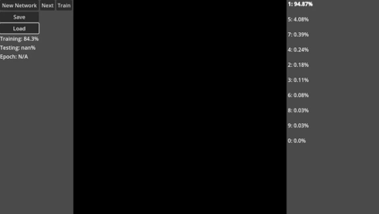

### Neural Network

This interactive neural network written from scratch in **Godot 4** and trained on the **MNIST Dataset** uses **backpropagation** and **gradient descent** to accurately recognize handwritten digits.

---

### Demo 
Predictions listed on the right side of the screen are ordered by how likely the network thinks each digit is.

---

#### References:
- https://github.com/SebLague/Neural-Network-Experiments
